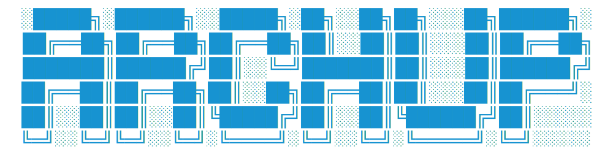

<p align="center">
  
</p>

## What Is ArchUp?

ArchUp is a minimal Arch Linux installer for Wayland. Boot the ISO, run it, and you get a working barebone system. Hardware is detected automatically and defaults are sensible. Afterward, you can optionally add a desktop environment.

**Includes:**
- Lean system without unnecessary packages
- Ready-to-use shell environment with modern CLI tools configured and themed
- CPU optimization (amd_pstate/cpu governor) and automatic GPU driver detection
- Essential libraries and packages (Qt5, GTK4, etc.) for a functional environment
- Coherent theme applied across all supported applications
- Full customization after installation

**Does not include:**
- KDE, GNOME, or other full desktop environments
- Any attempt to be a standalone distro
- Locked-in configurations
- Bloated softwares

## Get Started

**Need:** AMD/Intel 64-bit system, UEFI

Boot the Arch ISO and run:

```bash
curl -fsSL https://archup.run/install | bash
```

Reboot when done.

For development versions:
```bash
curl -fsSL https://archup.run/install/dev | bash
```

## What's Installed

**Core system:**
- btrfs filesystem, Limine bootloader, Plymouth
- Kernel selection: linux, linux-lts, or linux-zen
- GPU drivers and firmware (auto-detected)
- NetworkManager, OpenSSH, systemd-resolved

**CLI tools:**
- Neovim, Git, sudo, man pages
- Modern utilities: fzf, ripgrep, bat, eza, zoxide, starship, btop, yazi
- Build tools: gcc, make, Go, Rust (for AUR packages)

**System utilities:**
- Snapper for snapshots and rollbacks
- Bluetooth and audio configuration
- Firewall (ufw) and power management (TLP)
- Shell completion and theme system

Run `archup wizard` after installation to add a Wayland compositor (Hyprland, Sway, Niri, or River) with integrated theming. Support will expand as the community contributes.

## Status

- [x] Barebone installer (functional, testing in progress)
- [x] CLI auto-builds on first boot
- [ ] Desktop wizard (in progress in [archup-cli](https://github.com/bnema/archup-cli))

Active development. Report bugs with logs.

## Acknowledgments

- [Omarchy](https://github.com/omakub/omakub) - modular architecture approach
- [Charmbracelet Gum](https://github.com/charmbracelet/gum) - interactive UI toolkit
